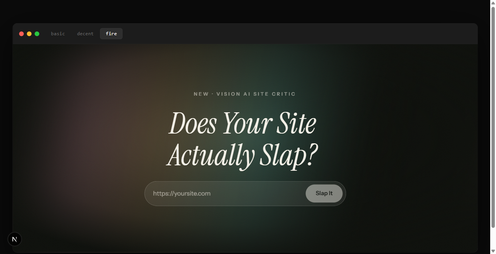

# Site Slap

Paste a URL. Get a score out of 100. Get roasted.

Site Slap is an AI design critic. It takes a screenshot of any live website, shows it to a vision model, and returns a verdict the way a person with taste would: a score, one punchy sentence, three specific roasts, and three fixes. No SEO metrics, no Lighthouse audit. Visual judgment only.

**Live at [site-slap-topaz.vercel.app](https://site-slap-topaz.vercel.app)**

## Features

- **Score, verdict, roast, fixes.** A vision model judges the screenshot on layout, hierarchy, color, spacing, and typography, then tells you exactly what it saw. The scoring scale is calibrated with real anchors, so a chaotic site lands in the teens instead of a polite 60.
- **View Upgraded.** The flagship. A draggable, mac-style popup window renders your site rebuilt with the fixes applied, generated as a single self-contained HTML file and displayed live in a sandboxed iframe. Two tiers: a minor upgrade (first fix only) and a full redesign.
- **Background preloading.** Both upgrade tiers start generating the moment your result lands, so the popup usually opens already loaded.
- **Three skins.** The same app rendered at three levels of design effort: basic (raw HTML energy), decent (clean and sensible), and fire (aurora gradient hero in pure CSS, snap scrolling, a count-up score, cinematic pacing). The skin switcher doubles as a live demonstration of what the score scale means.

## How It Works

```
URL → Microlink screenshot → Groq (Llama 4 Scout) judges it → score + roast + fixes
                                    ↓
              screenshot + fixes → Claude Haiku writes the upgraded site → sandboxed iframe
```

1. [Microlink](https://microlink.io) screenshots the live site. No headless browser to run or maintain.
2. Groq's Llama 4 Scout scores and roasts the screenshot. This tier runs free.
3. Claude Haiku rebuilds the site as one HTML file with the fixes applied, about three cents per render. The generated page contains no JavaScript, and the iframe's empty `sandbox` attribute means none could run anyway.
4. A daily cap on the upgrade route keeps a viral day from becoming an expensive one.

## Stack

- Next.js 16 (App Router) with TypeScript and CSS Modules
- Groq SDK for scoring, Anthropic SDK for the upgrade renderer
- Deployed on Vercel

## Running Locally

```bash
git clone https://github.com/Zrk16/site-slap.git
cd site-slap
npm install
```

Create `.env.local` with two keys:

```
GROQ_API_KEY=your_groq_key
ANTHROPIC_API_KEY=your_anthropic_key
```

Then:

```bash
npm run dev
```

Open [http://localhost:3000](http://localhost:3000), paste a URL, and brace yourself.

## A Note on the Scoring

The model is deliberately harsh. Minimal is not the same as designed, and blank is not the same as clean. If your site scores a 40, the fixes tab tells you exactly why, and the View Upgraded popup shows you what listening would look like.

Go slap your own site before someone else does.
